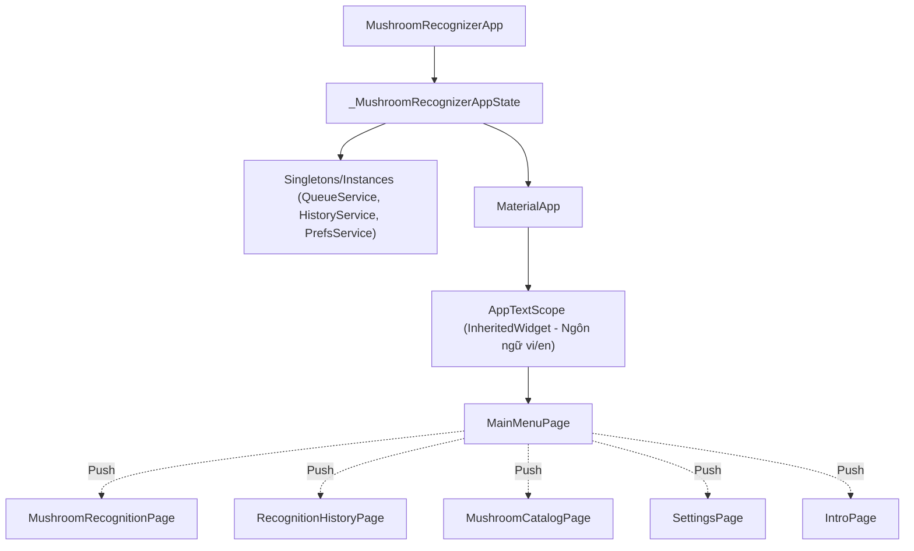
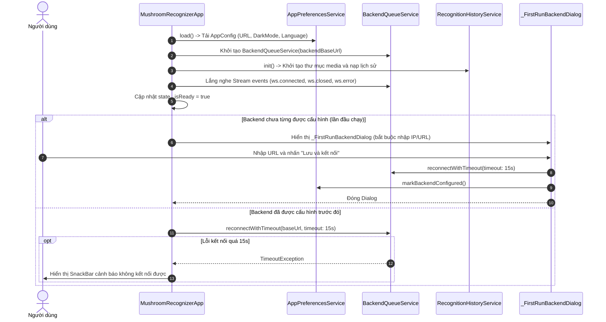

# 01 - Architecture Overview

Tài liệu này đặc tả kiến trúc cấp cao, công nghệ nền tảng và vòng đời khởi tạo của ứng dụng **app_mushroom**.

---

## 1. Công nghệ nền tảng (Tech Stack)

| Thành phần | Phiên bản / Thư viện | Vai trò |
| :--- | :--- | :--- |
| **Framework** | Flutter 3.11+ / Dart SDK `^3.11.4` | Nền tảng ứng dụng đa nền tảng |
| **Design System** | Material Design 3 (`useMaterial3: true`) | Giao diện người dùng hiện đại, hỗ trợ Dynamic Color |
| **Networking (HTTP)** | `http: ^1.4.0`, `http_parser: ^4.1.2` | Gọi REST API, upload Multipart file |
| **Realtime Messaging** | `web_socket_channel: ^3.0.3` | Nhận sự kiện hàng đợi và trạng thái Job thời gian thực |
| **Local Storage** | `shared_preferences: ^2.5.3` | Lưu cấu hình ứng dụng và metadata lịch sử nhận diện |
| **Media Processing** | `image_picker: ^1.1.2` | Chụp ảnh, quay video từ camera hoặc chọn từ thư viện |
| | `video_player: ^2.9.5` | Đọc thông tin video (duration probe) |
| | `video_thumbnail: ^0.5.3` | Trích xuất ảnh thu nhỏ tại các mốc thời gian của video |
| | `image: ^4.5.4` | Xử lý ảnh nguyên bản, tính toán ma trận điểm xám và gradient |
| | `path_provider: ^2.1.4` | Truy cập thư mục lưu trữ ứng dụng (`getApplicationDocumentsDirectory`) |

---

## 2. Mô hình tổ chức mã nguồn hiện tại

Mã nguồn của dự án hiện đang được tổ chức tập trung:
- [`lib/main.dart`](file:///d:/500gb%20hdd%27s%20data/VSCodeProject/flutter/test/app_mushroom/lib/main.dart): Điểm nhập liệu tối giản (`void main() => runApp(...)`).
- [`lib/app.dart`](file:///d:/500gb%20hdd%27s%20data/VSCodeProject/flutter/test/app_mushroom/lib/app.dart): Chứa toàn bộ:
  - Quản lý trạng thái gốc (`MushroomRecognizerApp`, `_MushroomRecognizerAppState`)
  - Cơ chế đa ngôn ngữ kế thừa (`AppTextScope`, `AppLanguage`)
  - 5 màn hình (`MainMenuPage`, `MushroomRecognitionPage`, `MushroomCatalogPage`, `RecognitionHistoryPage`, `SettingsPage`, `IntroPage`)
  - 4 Service nghiệp vụ (`BackendQueueService`, `RecognitionHistoryService`, `FrameSelectorService`, `AppPreferencesService`)
  - Toàn bộ Data Models (`QueueJob`, `PreparedFrame`, `QueueEvent`, `RecognitionHistoryItem`, `MushroomCatalogResponse`, ...)

---

## 3. Quản lý trạng thái & Phân cấp Widget (State Hierarchy)

Ứng dụng kết hợp giữa **Service-oriented State** và **InheritedWidget**:



### 3.1. Hệ thống Theme (Material 3)
Theme được sinh tự động thông qua `ColorScheme.fromSeed`:
- **Chế độ Sáng (Light Mode):** Seed color `#4F772D` (Màu xanh rêu thực vật).
- **Chế độ Tối (Dark Mode):** Seed color `#90A955` (Màu xanh olive nhạt).
- Card Theme: `borderRadius: 18`, độ nâng `elevation` là 1 ở Light mode và 0 ở Dark mode.
- Input Decoration: Viền bo tròn `borderRadius: 14`.

### 3.2. Hệ thống Đa ngôn ngữ (Localization)
- Không dùng file `.arb` truyền thống, ứng dụng triển khai `AppTextScope` kế thừa `InheritedWidget`.
- Hỗ trợ 2 ngôn ngữ: `AppLanguage.vi` (mặc định) và `AppLanguage.en`.
- Cú pháp dịch chuỗi nhanh trên UI:
  ```dart
  tr(context, vi: 'Bắt đầu nhận diện', en: 'Start recognition');
  ```

---

## 4. Vòng đời khởi chạy ứng dụng (Bootstrap Lifecycle)

Quy trình khởi chạy khi mở app được thực thi trong hàm `_bootstrap()` của `_MushroomRecognizerAppState`:



### Các trạng thái khởi tạo chính:
1. `_isReady == false`: Màn hình hiển thị `CircularProgressIndicator()`.
2. `_initError != null`: Hiển thị thông báo lỗi khởi tạo ở giữa màn hình.
3. `_isReady == true`: Render `MaterialApp` bao bọc `MainMenuPage` kèm badge trạng thái kết nối WebSocket.

