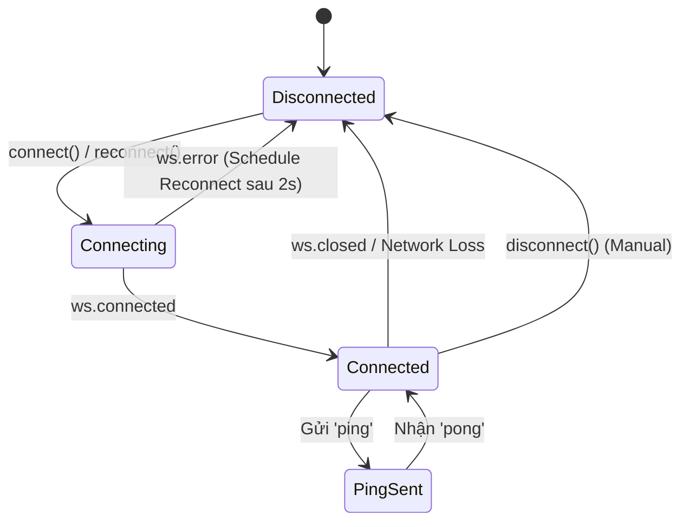

# 02 - Backend API & WebSocket Protocol

Tài liệu này đặc tả toàn bộ hợp đồng giao tiếp (Contract) giữa ứng dụng Flutter và máy chủ Backend (FastAPI).

---

## 1. Cấu hình địa chỉ mạng & Chuẩn hóa URL

### 1.1. Địa chỉ mặc định và thiết bị
- **Android Emulator:** `http://10.0.2.2:8000` (địa chỉ mặc định `kDefaultBackendBaseUrl`)
- **iOS Simulator:** `http://127.0.0.1:8000` hoặc `http://localhost:8000`
- **Thiết bị thật (Physical Device):** `http://<IP-LAN-Máy-Chạy-Backend>:8000` (ví dụ: `http://192.168.1.15:8000`)

### 1.2. Logic chuẩn hóa (`BackendQueueService.normalizeBaseUrl`)
Mọi URL nhập vào đều được xác thực và chuẩn hóa trước khi lưu:
1. Bắt buộc có scheme `http` hoặc `https`.
2. Bắt buộc có host và port (Authority).
3. Loại bỏ toàn bộ `path`, `query`, `fragment` và dấu gạch chéo tận cùng (`/`).
4. URL kết quả luôn có dạng: `http://192.168.1.15:8000`.

---

## 2. Các Endpoint REST API (HTTP)

### 2.1. Lấy danh mục nấm (`GET /api/mushrooms/catalog`)

- **Mục đích:** Tải danh sách các loài nấm trong bộ dữ liệu huấn luyện, thống kê tỷ lệ nấm độc / an toàn.
- **Headers:** `Accept: application/json`
- **Mã phản hồi HTTP:**
  - `200 OK`: Trả về thông tin danh mục.
  - Khác 200: Ném ngoại lệ `HTTP <status_code>: <error_body>`.
- **Cấu trúc JSON phản hồi:**
  ```json
  {
    "source": "mushroom_dataset_v1",
    "total": 54,
    "poisonous_count": 20,
    "safe_count": 34,
    "mushrooms": [
      {
        "name": "Agaricus bisporus",
        "scientific_name": "Agaricus bisporus",
        "is_poisonous": false
      },
      {
        "name": "Amanita phalloides",
        "scientific_name": "Amanita phalloides",
        "is_poisonous": true
      }
    ],
    "poisonous_mushrooms": [
      {
        "name": "Amanita phalloides",
        "scientific_name": "Amanita phalloides",
        "is_poisonous": true
      }
    ]
  }
  ```

---

### 2.2. Upload ảnh và tạo Job nhận diện (`POST /api/images/upload`)

- **Mục đích:** Đẩy dữ liệu khung hình ảnh (ảnh chụp hoặc frame trích xuất từ video) lên server để đưa vào hàng đợi xử lý.
- **Content-Type:** `multipart/form-data`
- **Form Fields:**
  - `file`: Dữ liệu binary của file ảnh (`MultipartFile.fromBytes`).
  - `filename`: Tên file gốc hoặc định dạng `upload-<timestamp>.<ext>`.
  - `contentType`: Tự động nhận diện (`image/jpeg`, `image/png`, `image/webp`, `image/bmp`, `image/gif`, `image/tiff`).
- **Mã phản hồi HTTP:**
  - `200 OK` / `201 Created`: Tạo job thành công.
  - `4xx / 5xx`: Ném ngoại lệ kèm thông điệp lỗi trích xuất từ trường `detail`, `error` hoặc `message`.
- **Cấu trúc JSON phản hồi:**
  ```json
  {
    "job_id": "job_9b3e1f2a-7c8d-4e5f-9a1b-3c4d5e6f7a8b",
    "status": "queued"
  }
  ```

---

### 2.3. Lấy trạng thái và kết quả Job (`GET /api/jobs/{job_id}`)

- **Mục đích:** Thăm dò định kỳ (polling) trạng thái và lấy kết quả dự đoán của job.
- **Mã phản hồi HTTP:**
  - `200 OK`: Job đang xử lý hoặc đã có kết quả.
  - `404 Not Found`: Server không tìm thấy job. App sẽ tự chuyển trạng thái job thành `JobStatus.failed` kèm lỗi `"Job không tồn tại (404)"`.
  - Khác: Ném Exception.
- **Cấu trúc JSON phản hồi chi tiết:**
  ```json
  {
    "job_id": "job_9b3e1f2a-7c8d-4e5f-9a1b-3c4d5e6f7a8b",
    "status": "completed",
    "result": {
      "prediction": "Amanita muscaria",
      "mushroom_name": "Nấm tán bay (Fly agaric)",
      "raw_prediction": "Amanita muscaria",
      "accepted_prediction": true,
      "confidence": 0.9452,
      "confidence_threshold": 0.70,
      "is_poisonous": true,
      "decision_reason": "High confidence above threshold",
      "image_type": "jpeg",
      "size_bytes": 142580,
      "sha256": "e3b0c44298fc1c149afbf4c8996fb92427ae41e4649b934ca495991b7852b855",
      "inference_time_seconds": 0.384
    },
    "error": null
  }
  ```

#### Giải thích các trường trong `result`:
- `prediction`: Nhãn kết quả cuối cùng sau khi đánh giá ngưỡng tin cậy. Nếu không đạt ngưỡng, giá trị có thể là `"unknown"`.
- `raw_prediction`: Nhãn gốc mô hình AI suy luận trước khi áp ngưỡng lọc.
- `accepted_prediction` (`bool`): `true` nếu độ tin cậy vượt qua ngưỡng cho phép, `false` nếu bị từ chối do độ tin cậy thấp.
- `confidence` (`double`): Điểm tin cậy (từ `0.0` đến `1.0` hoặc dạng phần trăm `0 - 100%`).
- `confidence_threshold` (`double`): Ngưỡng tin cậy tối thiểu được cấu hình trên backend.
- `is_poisonous` (`bool`): `true` là nấm độc, `false` là nấm an toàn/ăn được.
- `decision_reason` (`string`): Lý do backend đưa ra quyết định (ví dụ: giải thích tại sao không chấp nhận kết quả).
- `inference_time_seconds` (`double`): Thời gian mô hình AI thực thi suy luận trên máy chủ.

---

## 3. Giao thức WebSocket Hàng đợi (`/ws/queue`)

### 3.1. Thiết lập kết nối
- **URL WebSocket:** Chuyển đổi từ HTTP URL:
  - `http://host:port/ws/queue` -> `ws://host:port/ws/queue`
  - `https://host:port/ws/queue` -> `wss://host:port/ws/queue`

### 3.2. Chu trình sống & Tự phục hồi (Lifecycle & Auto-Reconnect)



1. **Auto Reconnect:** Khi xảy ra `ws.error` hoặc `ws.closed`, nếu `_autoReconnectEnabled == true`, một Timer 2 giây sẽ tự động kích hoạt để kết nối lại.
2. **Ping-Pong:** 
   - Client gửi bản tin dạng chuỗi văn bản thuần túy: `"ping"`.
   - Server phản hồi chuỗi văn bản: `"pong"`.
   - Khi nhận `"pong"`, client phát sự kiện nội bộ `QueueEvent(event: 'pong')`.
3. **Timeout khi cấu hình:** Phương thức `reconnectWithTimeout(baseUrl, timeout: 15s)` đợi sự kiện `ws.connected`. Nếu quá 15 giây không kết nối thành công, ném `TimeoutException`.

### 3.3. Các sự kiện (Events) từ WebSocket

Các bản tin gửi qua WebSocket có cấu trúc JSON:
```json
{
  "event": "<tên_sự_kiện>",
  "data": { ... }
}
```
*(Nếu payload chứa key `type` thay vì `event`, client sẽ tự động chuẩn hóa thành `event`).*

| Tên sự kiện (`event`) | Ý nghĩa | Dữ liệu kèm theo (`data`) |
| :--- | :--- | :--- |
| `queue.snapshot` | Danh sách toàn bộ các job đang xếp hàng | `{ "jobs": [ ... ] }` |
| `queue.status` | Trạng thái tổng quan của hàng đợi | `{ "pending_jobs": 2, "processing_jobs": 1 }` |
| `job.status` | Thay đổi trạng thái một job cụ thể | `{ "job_id": "...", "status": "queued" / "processing" }` |
| `job.result` | Kết quả suy luận cuối cùng của job | `{ "job_id": "...", "status": "completed", "result": { ... }, "error": null }` |
| `ws.connected` | Sự kiện cục bộ thông báo WS đã kết nối | `{ "url": "ws://..." }` |
| `ws.closed` | Sự kiện cục bộ thông báo WS bị đóng | `{ "reason": "..." }` |
| `ws.error` | Sự kiện cục bộ thông báo lỗi socket | `{ "message": "..." }` |

---

## 4. Cơ chế đồng bộ kép (Dual-Sync Architecture)

Để đảm bảo không bao giờ bị mất trạng thái của job ngay cả khi WebSocket bị gián đoạn mạng hoặc rớt gói tin:

1. **Kênh chính (Push):** Lắng nghe stream WebSocket. Khi nhận sự kiện `job.status` hoặc `job.result`, client cập nhật tức thì vào bộ nhớ `_jobs[jobId]` và đồng bộ vào `RecognitionHistoryService`.
2. **Kênh dự phòng (Pull / Polling):**
   - Một Timer tuần hoàn mỗi **2 giây** (`_pollTimer`) quét qua danh sách các job có trạng thái `JobStatus.queued` hoặc `JobStatus.processing`.
   - Gọi HTTP `GET /api/jobs/{job_id}` để cập nhật trạng thái mới nhất.
   - Khi job chuyển sang `completed` hoặc `failed`, job đó tự động không còn nằm trong danh sách polling.

