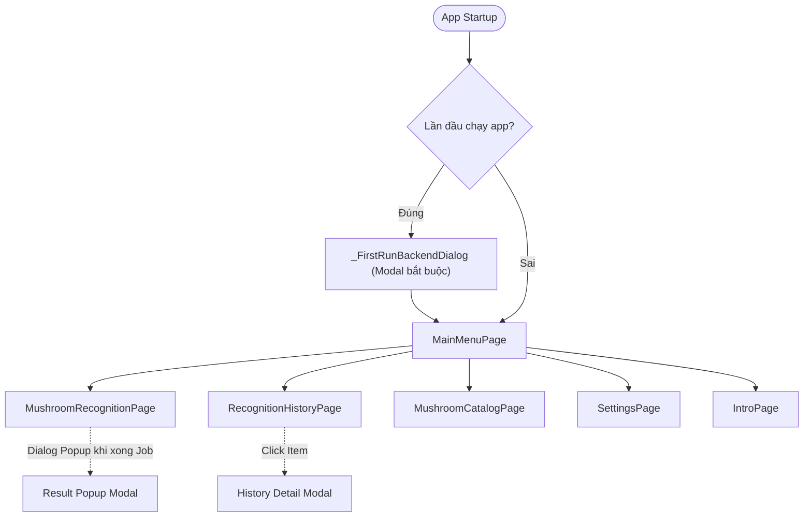

# 03 - UI & Screens Specification

Tài liệu này đặc tả chi tiết toàn bộ các màn hình, thành phần giao diện (Widgets), luồng điều hướng (Navigation Flow) và tương tác người dùng trong ứng dụng **app_mushroom**.

---

## 1. Sơ đồ điều hướng (Navigation Hierarchy)

---

## 2. Đặc tả chi tiết từng màn hình

### 2.1. Hộp thoại thiết lập lần đầu (`_FirstRunBackendDialog`)
- **Điều kiện kích hoạt:** Khi khởi động app, `AppPreferencesService.isBackendConfigured()` trả về `false`.
- **Đặc điểm:** Hộp thoại `AlertDialog` không thể bấm ra ngoài để tắt (`barrierDismissible: false`).
- **Thành phần:**
  - Tiêu đề: *"Thiết lập backend lần đầu"* / *"First-time backend setup"*.
  - `TextField` nhập URL backend (mặc định hiển thị `http://10.0.2.2:8000`).
  - Thanh tiến trình `LinearProgressIndicator` khi đang thử kết nối.
  - Nút bấm *"Lưu và kết nối"*:
    - Chuẩn hóa URL -> Lưu vào Preferences -> Thử kết nối WebSocket với timeout 15 giây (`queue.reconnectWithTimeout(timeout: 15s)`).
    - Thành công: Đánh dấu `backend_configured = true` và tự động đóng modal.
    - Thất bại: Hiển thị thông báo lỗi màu đỏ ngay dưới ô nhập liệu.

---

### 2.2. Màn hình chính (`MainMenuPage`)
- **Giao diện:** Nền dải màu chuyển sắc (Linear Gradient) tạo cảm giác tự nhiên hiện đại.
- **Thành phần trên Header:**
  - Tiêu đề ứng dụng: *"App Nhận Diện Nấm"* / *"Mushroom Recognition App"*.
  - Thẻ tóm tắt cấu hình:
    - Chip 1: Hiển thị URL backend hiện tại (`Backend: http://...`).
    - Chip 2: Trạng thái kết nối WebSocket (`WS đang kết nối...` / `WS đang kết nối` màu xanh / `WS đang ngắt` màu đỏ).
- **Danh sách thẻ chức năng (`_MenuActionCard`):**
  1. **Bắt đầu nhận diện:** Điều hướng tới `MushroomRecognitionPage`.
  2. **Lịch sử nhận diện:** Điều hướng tới `RecognitionHistoryPage`.
  3. **Xem danh sách nấm trong bộ dữ liệu:** Điều hướng tới `MushroomCatalogPage`.
  4. **Cài đặt:** Điều hướng tới `SettingsPage`.
  5. **Giới thiệu:** Điều hướng tới `IntroPage`.

---

### 2.3. Màn hình nhận diện nấm (`MushroomRecognitionPage`)
Đây là màn hình cốt lõi của ứng dụng, gồm 5 khối nội dung xếp theo chiều dọc trong `ListView`:

#### Khối 1: Thông tin kết nối
- Hiển thị HTTP URL và trạng thái kết nối WebSocket.
- Gợi ý người dùng vào màn hình Cài đặt nếu cần đổi IP.

#### Khối 2: Bộ chọn phương thức nhập liệu (Media Selector)
- 3 nút bấm kích hoạt:
  1. `Upload ảnh`: Mở thư viện ảnh thiết bị (`ImageSource.gallery`).
  2. `Chụp ảnh`: Mở camera chụp ảnh tĩnh (`ImageSource.camera`).
  3. `Quay video`: Mở camera quay video (`ImageSource.camera`).

#### Khối 3: Khung xem trước & Đánh giá chất lượng (`PreparedFrame`)
- Hiển thị khi đã chọn ảnh hoặc đã trích xuất frame từ video.
- Các thông số hiển thị:
  - Ảnh xem trước dạng `ClipRRect` bo tròn viền.
  - Nguồn ảnh: `Ảnh tĩnh` hoặc `Video (đã chọn frame tốt nhất)`.
  - Dung lượng file (bytes).
  - Điểm chất lượng hình ảnh: Được tính theo thang điểm `0.0 - 100.0`.
  - Mốc thời gian frame được chọn (`Selected frame: ... ms`) nếu nguồn là video.
  - Nút bấm: *"Upload ảnh và tạo job"* -> Gửi ảnh lên server.

#### Khối 4: Danh sách công việc trong hàng đợi (`Job queue`)
- Hiển thị danh sách các job đã tạo trong phiên làm việc dưới dạng `_JobResultCard`:
  - Mã định danh Job (`Job: ...`).
  - Trạng thái hiện tại: `queued` (vàng), `processing` (xanh dương), `completed` (xanh lá), `failed` (đỏ).
  - Ảnh preview thu nhỏ.
  - Thời gian cập nhật cuối.
  - Nếu đã hoàn thành: Nhúng trực tiếp widget `_ResultPayloadView`.

#### Khối 5: Nhật ký sự kiện WebSocket gần đây (Event Log)
- Hiển thị danh sách tối đa 10 sự kiện realtime gần nhất theo font chữ Monospace, giúp người dùng và lập trình viên quan sát luồng trao đổi dữ liệu.

#### Popup tự động hiển thị kết quả:
- Khi job chuyển sang trạng thái `completed` hoặc `failed`, nếu người dùng đang ở màn hình nhận diện, app sẽ tự động bật hộp thoại `AlertDialog` hiển thị toàn bộ chi tiết dự đoán (được lọc qua `_shownResultDialogJobs` để tránh popup lặp lại).

---

### 2.4. Thành phần hiển thị kết quả suy luận (`_ResultPayloadView`)
Widget chuyên biệt được tái sử dụng ở nhiều màn hình (Recognition, History, Result Dialog):
- **Hộp thông tin nổi bật (Highlight Chips):**
  - **Tên loài nấm:** Tên tiếng Việt hoặc tên khoa học, hoặc `Không xác định` nếu nhãn là `unknown`.
  - **Dự đoán:** Nhãn `prediction`.
  - **Độ tin cậy:** Định dạng phần trăm chính xác 2 chữ số thập phân (ví dụ: `94.52%`).
  - **Cảnh báo độc tính:**
    - Nấm an toàn: Màu xanh lá cây (`Nấm an toàn` / `Safe mushroom`).
    - Nấm độc: Màu đỏ cảnh báo (`Nấm độc` / `Poisonous mushroom`).
    - Không xác định: Màu cam cảnh báo.
- **Bảng chi tiết thông số kỹ thuật (`_ResultRow`):**
  - Dự đoán gốc (`raw_prediction`)
  - Dự đoán đã chấp nhận (`accepted_prediction`)
  - Ngưỡng độ tin cậy chấp nhận (`confidence_threshold`)
  - Lý do quyết định (`decision_reason`)
  - Loại hình ảnh (`image_type`)
  - Kích thước ảnh (`size_bytes`)
  - Mã băm SHA-256 (`sha256`)
  - Thời gian suy luận (`inference_time_seconds`)

---

### 2.5. Màn hình danh mục nấm (`MushroomCatalogPage`)
- Hỗ trợ kéo xuống để làm mới (`RefreshIndicator`).
- **Thẻ thống kê nhanh:**
  - Tổng số loài nấm trong bộ dữ liệu (`Total`).
  - Số lượng loài an toàn (`Safe`).
  - Số lượng loài có độc (`Poisonous`).
  - Tên nguồn dữ liệu (`Source`).
- **Danh sách từng loài:**
  - Tên phổ thông + Tên khoa học dạng chữ nghiêng.
  - Phân loại màu nền rõ rệt: Màu đỏ mờ cho nấm độc (`isPoisonous == true`), màu xanh lá mờ cho nấm an toàn.

---

### 2.6. Màn hình lịch sử nhận diện (`RecognitionHistoryPage`)
- Tải danh sách các lần nhận diện đã lưu từ `RecognitionHistoryService`.
- Mỗi dòng hiển thị:
  - Ảnh preview thu nhỏ từ bộ nhớ máy (`File(previewImagePath)`).
  - Tên nấm, nhãn dự đoán, mã Job, thời gian thực hiện.
  - Badge trạng thái (`completed`, `failed`, `processing`, `queued`).
- Khi chạm vào một mục bất kỳ: Mở hộp thoại xem chi tiết toàn bộ thông tin kết quả suy luận và ảnh gốc.

---

### 2.7. Màn hình Cài đặt (`SettingsPage`)
- Ô nhập liệu Backend URL.
- Nút tác vụ:
  - `Lưu backend`: Chỉ lưu cấu hình URL vào SharedPreferences.
  - `Kết nối WS`: Lưu cấu hình và kết nối lại WebSocket.
  - `Ngắt WS`: Chủ động ngắt kết nối WebSocket hiện tại.
  - `Ping`: Gửi chuỗi `"ping"` kiểm tra độ phản hồi của server.
- Cài đặt giao diện:
  - Lựa chọn ngôn ngữ (`Tiếng Việt` / `English`).
  - Công tắc bật/tắt Chế độ tối (`Dark mode`).
- Bảng nhật ký sự kiện WebSocket gần nhất (lưu trữ 20 sự kiện gần nhất).

---

### 2.8. Màn hình Giới thiệu (`IntroPage`)
Hiển thị các thẻ thông tin hướng dẫn người dùng:
1. **Mục tiêu ứng dụng:** Nhận diện nấm qua ảnh và video, cơ chế hàng đợi xử lý.
2. **Cách sử dụng nhanh:** 3 bước thao tác chuẩn.
3. **Ý nghĩa kết quả:** Giải thích rõ sự khác biệt giữa `prediction`, `raw_prediction`, `accepted_prediction`, và `decision_reason`.
4. **Lưu ý an toàn sinh học:** Cảnh báo quan trọng: *Kết quả AI chỉ mang tính tham khảo, tuyệt đối không ăn thử nấm dựa trên kết quả của ứng dụng.*

