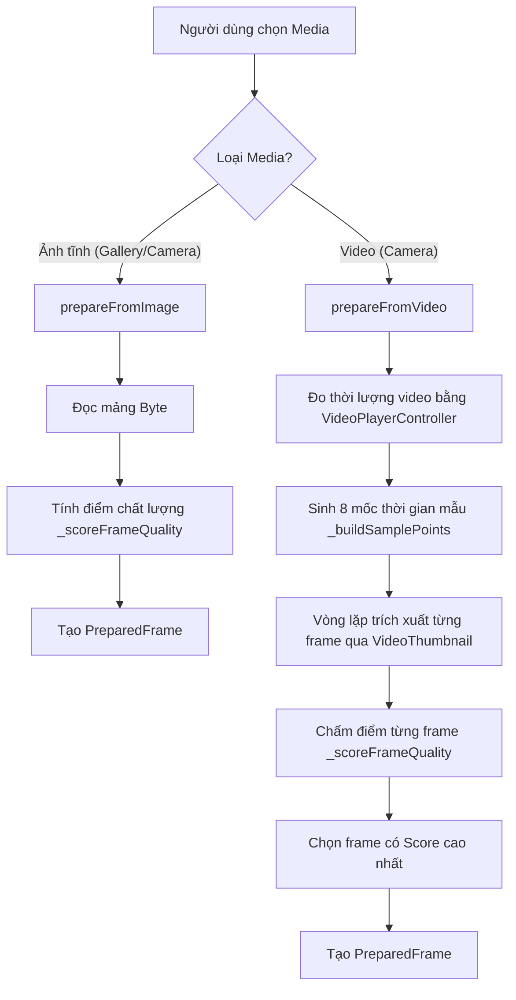

# 04 - Media Processing & Frame Selection

Tài liệu này đặc tả chi tiết thuật toán xử lý media, trích xuất khung hình từ video và công thức chấm điểm chất lượng ảnh trong `FrameSelectorService`.

---

## 1. Mục tiêu và bối cảnh

Khi người dùng nhận diện nấm bằng video quay trực tiếp trên điện thoại:
- Người dùng thường lia máy, tay run, khung hình có thể bị nhòe (motion blur), thiếu sáng hoặc cháy sáng.
- Việc gửi toàn bộ video lên server tốn băng thông và tăng độ trễ mạng.
- **Giải pháp:** Xử lý trực tiếp trên client bằng cách lấy mẫu nhiều khung hình trong video, áp dụng thuật toán thị giác máy tính (Computer Vision) để đánh giá độ nét và ánh sáng, sau đó tự động chọn ra khung hình có chất lượng cao nhất để gửi lên backend.

---

## 2. Quy trình xử lý phương tiện (Media Ingestion Pipeline)

---

## 3. Thuật toán trích xuất frame từ Video (`prepareFromVideo`)

### 3.1. Đo thời lượng video (`_probeDuration`)
- Khởi tạo controller tạm thời: `VideoPlayerController.file(File(path))`.
- Chờ khởi tạo `await controller.initialize()`.
- Lấy tổng thời lượng `controller.value.duration`.
- Hủy controller ngay sau khi xong (`await controller.dispose()`) để giải phóng tài nguyên phần cứng.

### 3.2. Chiến lược lấy mẫu thời gian (`_buildSamplePoints`)
- Số lượng mốc lấy mẫu cố định: `sampleCount = 8`.
- Nếu thời lượng $\le 0\text{ ms}$, trả về `[0]`.
- Mốc an toàn cuối: $\text{safeEnd} = \max(1, \text{totalMs} - 1)$.
- Bước nhảy: $\text{step} = \frac{\text{safeEnd}}{\text{sampleCount} + 1}$.
- 8 mốc thời gian được phân bố đều dọc theo dòng thời gian video:
  $$t_i = \text{round}(\text{step} \times i) \quad \text{với } i \in [1, 8]$$
  *(Ví dụ: Với video dài 9 giây, các frame sẽ được lấy mẫu tại 1s, 2s, 3s, ..., 8s để tránh frame đen ở đầu/cuối video).*

### 3.3. Trích xuất ảnh thu nhỏ (`VideoThumbnail.thumbnailData`)
Mỗi mốc thời gian được xuất ảnh với thông số cấu hình cao:
- **Định dạng:** `ImageFormat.JPEG`
- **Chất lượng:** `quality: 95` (nén rất nhẹ để giữ chi tiết vi thể của nấm)
- **Độ phân giải giới hạn:** `maxWidth: 720` (chuẩn HD, cân bằng giữa chi tiết và dung lượng bộ nhớ)

---

## 4. Thuật toán chấm điểm chất lượng ảnh (`_scoreFrameQuality`)

Thuật toán hoạt động trên mảng bytes thô (`Uint8List`) thông qua thư viện `image` của Dart:

### 4.1. Tối ưu hóa kích thước tính toán (Downsampling)
- Giải mã ảnh: `img.decodeImage(bytes)`.
- Nếu chiều rộng ảnh $> 320\text{ px}$, ảnh được thu nhỏ về chiều rộng $320\text{ px}$ bằng hàm `img.copyResize(decoded, width: 320)`.
- **Mục đích:** Đảm bảo tốc độ tính toán ma trận điểm ảnh đạt mức thời gian thực trên mọi thiết bị di động mà không gây treo giao diện.

### 4.2. Chuyển đổi sang ảnh xám (Grayscale Conversion)
Chuyển đổi từng pixel $(R, G, B)$ sang độ sáng chuẩn Rec. 601 Luma:
$$\text{Lum}(x, y) = 0.299 \times R + 0.587 \times G + 0.114 \times B$$
Tính toán độ sáng trung bình toàn ảnh:
$$\overline{\text{Lum}} = \frac{1}{W \times H} \sum_{y=0}^{H-1} \sum_{x=0}^{W-1} \text{Lum}(x, y)$$

### 4.3. Tính toán năng lượng Gradient 2 chiều (Sharpness Measure)
Sử dụng toán tử vi phân không gian trung tâm bậc nhất để đo độ biến thiên cạnh (đo độ sắc nét / chống nhòe):
- Độ biến thiên theo trục ngang:
  $$G_x(x, y) = \text{Lum}(x + 1, y) - \text{Lum}(x - 1, y)$$
- Độ biến thiên theo trục dọc:
  $$G_y(x, y) = \text{Lum}(x, y + 1) - \text{Lum}(x, y - 1)$$
- Năng lượng gradient tổng hợp tại điểm $(x, y)$:
  $$E(x, y) = \sqrt{G_x(x, y)^2 + G_y(x, y)^2}$$
- Gradient trung bình toàn ảnh (loại trừ biên):
  $$\overline{\text{Gradient}} = \frac{1}{(W - 2)(H - 2)} \sum_{y=1}^{H-2} \sum_{x=1}^{W-2} E(x, y)$$

Điểm sắc nét chuẩn hóa ($[0.0, 1.0]$):
$$\text{SharpnessScore} = \text{clamp}\left(\frac{\overline{\text{Gradient}}}{60}, 0.0, 1.0\right)$$
*(Hệ số 60 là ngưỡng thực nghiệm cho ảnh rõ nét cấu trúc mũ nấm và thân nấm).*

### 4.4. Tính điểm phơi sáng (Exposure Score)
Đo độ lệch của độ sáng trung bình so với mức chuẩn 128 (mức xám trung tính lý tưởng):
$$\text{ExposureScore} = \text{clamp}\left(1.0 - \frac{|\overline{\text{Lum}} - 128|}{128}, 0.0, 1.0\right)$$
- Nếu ảnh bị quá tối ($\overline{\text{Lum}} \to 0$) hoặc cháy sáng ($\overline{\text{Lum}} \to 255$), $\text{ExposureScore} \to 0$.
- Nếu ảnh có độ phơi sáng cân bằng quanh mức 128, $\text{ExposureScore} \to 1.0$.

### 4.5. Công thức điểm chất lượng tổng hợp (Quality Score)
Điểm số cuối cùng là trung bình có trọng số, ưu tiên độ sắc nét chiếm 80% và phơi sáng chiếm 20%:
$$\text{QualityScore} = \text{clamp}\left(0.8 \times \text{SharpnessScore} + 0.2 \times \text{ExposureScore}, 0.0, 1.0\right)$$

Khung hình có $\text{QualityScore}$ cao nhất trong 8 mẫu sẽ được chọn làm khung hình đại diện nạp vào `PreparedFrame`.

