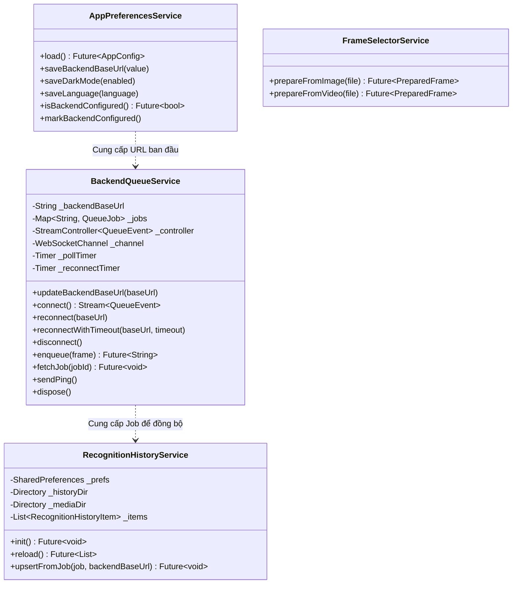

# 05 - Services & State Management

Tài liệu này đặc tả chi tiết toàn bộ các dịch vụ (Services), tầng logic nghiệp vụ và cơ chế quản lý trạng thái của ứng dụng **app_mushroom**.

---

## 1. Bản đồ các Dịch vụ (Services Map)



---

## 2. Dịch vụ Hàng đợi Backend (`BackendQueueService`)

Đóng vai trò điều phối toàn bộ luồng mạng (HTTP và WebSocket) với máy chủ:

### 2.1. Quản lý trạng thái kết nối
- `backendBaseUrl`: Chuỗi URL hiện thời đã được chuẩn hóa.
- `isWebSocketConnected`: Trả về `true` nếu socket đang mở.
- `events`: `Stream<QueueEvent>` dạng broadcast để nhiều màn hình cùng lắng nghe.

### 2.2. Phương thức điều khiển
1. **`enqueue(PreparedFrame frame)`**:
   - Gửi ảnh qua `http.MultipartRequest('POST', '/api/images/upload')`.
   - Tự động nhận diện định dạng MIME thông qua `_detectImageSubtype` (kiểm tra đuôi file và Magic bytes nhị phân).
   - Đọc `job_id` từ response, khởi tạo `QueueJob` với trạng thái `JobStatus.queued`.
   - Phát sự kiện `job.status` và tự động kích hoạt `unawaited(fetchJob(jobId))`.
2. **`fetchJob(String jobId)`**:
   - Gọi `GET /api/jobs/{jobId}`.
   - Nếu nhận HTTP 404: Tự chuyển trạng thái job sang `JobStatus.failed` với thông báo `"Job không tồn tại (404)"`.
   - Nếu thành công: Phân tích payload, cập nhật kết quả và phát sự kiện `job.status` / `job.result`.
3. **`sendPing()`**:
   - Gửi text `"ping"` qua WebSocket sink. Bắt ngoại lệ `StateError` nếu socket đã đóng để kích hoạt reconnect.
4. **`reconnectWithTimeout(baseUrl, timeout: 15s)`**:
   - Đợi sự kiện `ws.connected` trong giới hạn timeout. Nếu quá 15s, hủy lắng nghe và ném `TimeoutException`.
5. **`dispose()`**:
   - Dừng toàn bộ timer (polling, reconnect), đóng kênh WebSocket sink, đóng HTTP client và StreamController.

---

## 3. Dịch vụ Quản lý Lịch sử (`RecognitionHistoryService`)

Chịu trách nhiệm lưu trữ bền vững (Offline-first Persistence) toàn bộ kết quả nhận diện trên thiết bị:

### 3.1. Cấu trúc lưu trữ trên hệ thống file
- Sử dụng thư mục tài liệu cục bộ:
  ```
  <AppDocumentsDirectory>/
  └── recognition_history/
      └── media/
          ├── preview_<jobId>.jpg       # Ảnh thu nhỏ phục vụ danh sách hiển thị
          └── source_<jobId>.<ext>      # File phương tiện gốc (ảnh hoặc video)
  ```

### 3.2. Quy tắc lưu trữ và giới hạn
- **Khóa SharedPreferences:** `recognition_history_v1` (lưu mảng JSON serialize của `RecognitionHistoryItem`).
- **Giới hạn số lượng:** Tối đa **200 mục** (`_kMaxHistoryItems = 200`). Khi vượt quá 200, các bản ghi cũ nhất sẽ tự động bị cắt bỏ (`updated.removeRange(200, updated.length)`).
- **Quy tắc Upsert (`upsertFromJob`):**
  - Nếu Job ID đã tồn tại: Cập nhật thông tin mới nhất (trạng thái, kết quả, thời gian cập nhật).
  - Nếu Job ID chưa có: Tạo mới `RecognitionHistoryItem` và chèn vào đầu danh sách (sắp xếp giảm dần theo thời gian).
  - Tự động sao lưu ảnh preview và file gốc vào thư mục `media/` để tránh mất dữ liệu khi file tạm của hệ thống bị xóa.

---

## 4. Dịch vụ Lưu trữ Tùy chọn (`AppPreferencesService`)

Wrapper bao bọc `SharedPreferences` cho các thiết lập của người dùng:

| Tên Khóa (Key) | Kiểu dữ liệu | Mặc định | Ý nghĩa |
| :--- | :--- | :--- | :--- |
| `backend_base_url` | `String` | `http://10.0.2.2:8000` | URL máy chủ API |
| `dark_mode` | `bool` | `false` | Bật/tắt chế độ giao diện tối |
| `language_code` | `String` | `'vi'` | Mã ngôn ngữ hiển thị (`'vi'` hoặc `'en'`) |
| `backend_configured` | `bool` | `null` / `false` | Cờ đánh dấu người dùng đã cấu hình backend hay chưa |

---

## 5. Cơ chế Đa ngôn ngữ (`AppTextScope` & `tr`)

Ứng dụng xây dựng hệ thống bản địa hóa gọn nhẹ, không phụ thuộc vào file sinh mã của Flutter:

```dart
// Enum ngôn ngữ
enum AppLanguage { vi, en }

// InheritedWidget truyền ngôn ngữ xuống Widget Tree
class AppTextScope extends InheritedWidget { ... }

// Hàm tiện ích truy xuất chuỗi ngôn ngữ theo Context
String tr(BuildContext context, {required String vi, required String en}) {
  return AppTextScope.of(context).text(vi: vi, en: en);
}
```

- Khi người dùng đổi ngôn ngữ trong màn hình Cài đặt, hàm `onSetLanguage` được kích hoạt tại `MushroomRecognizerApp`, trigger lại hàm `build()` với ngôn ngữ mới.
- Nhờ `updateShouldNotify`, toàn bộ Widget con đang gọi `tr(context, ...)` sẽ được tự động vẽ lại với chuỗi tương ứng.

