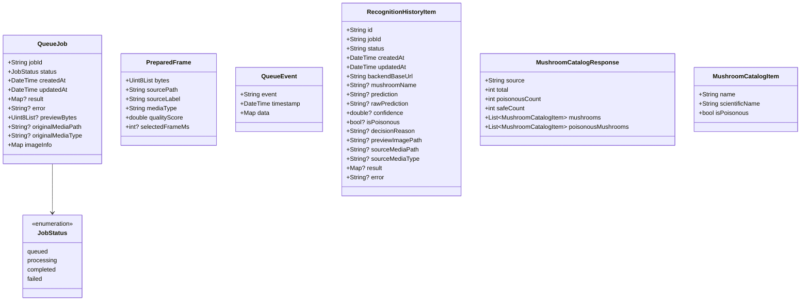

# 06 - Data Models & Storage Specification

Tài liệu này đặc tả toàn bộ các mô hình dữ liệu (Data Models), lược đồ JSON (JSON Schemas) và cơ chế lưu trữ trên thiết bị của ứng dụng **app_mushroom**.

---

## 1. Danh sách các Model trong ứng dụng



---

## 2. Chi tiết các Data Models

### 2.1. `JobStatus` (Enum)
- **Giá trị:**
  - `JobStatus.queued`: Công việc đang nằm trong hàng đợi chờ xử lý. Màu hiển thị: Amber/Cam (`Colors.amber.shade800`).
  - `JobStatus.processing`: Máy chủ đang chạy mô hình suy luận. Màu hiển thị: Xanh dương (`Colors.blue.shade700`).
  - `JobStatus.completed`: Xử lý thành công và đã có kết quả. Màu hiển thị: Xanh lá (`Colors.green.shade700`).
  - `JobStatus.failed`: Có lỗi xảy ra trong quá trình xử lý hoặc job không tồn tại. Màu hiển thị: Đỏ (`Colors.red.shade700`).

---

### 2.2. `PreparedFrame` (Model Frame Đã Chuẩn Bị)
Đại diện cho khung hình ảnh đã sẵn sàng để gửi lên backend:
- `bytes` (`Uint8List`): Mảng nhị phân của ảnh (JPEG).
- `sourcePath` (`String`): Đường dẫn file gốc trên thiết bị.
- `sourceLabel` (`String`): Nhãn nguồn (ví dụ: `"Ảnh tĩnh"` hoặc `"Video (đã chọn frame tốt nhất)"`).
- `mediaType` (`String`): `'image'` hoặc `'video'`.
- `qualityScore` (`double`): Điểm chất lượng tính được từ giải thuật ($0.0 - 1.0$).
- `selectedFrameMs` (`int?`): Mốc thời gian (mili-giây) trích xuất frame trong video, bằng `null` nếu là ảnh tĩnh.

---

### 2.3. `QueueJob` (Model Công Việc Hàng Đợi)
Theo dõi trạng thái của một tác vụ nhận diện trong suốt phiên chạy:
- `jobId` (`String`): Định danh duy nhất do máy chủ trả về.
- `status` (`JobStatus`): Trạng thái hiện tại.
- `createdAt` (`DateTime`): Thời điểm tạo job (UTC).
- `updatedAt` (`DateTime`): Thời điểm cập nhật trạng thái mới nhất (UTC).
- `result` (`Map<String, dynamic>?`): Dữ liệu kết quả suy luận từ server.
- `error` (`String?`): Thông báo lỗi nếu có.
- `previewBytes` (`Uint8List?`): Dữ liệu ảnh thu nhỏ để render trực tiếp trên UI.
- `originalMediaPath` (`String?`): Đường dẫn file media ban đầu.
- `originalMediaType` (`String?`): Loại media (`image` / `video`).
- `imageInfo` (`Map<String, dynamic>`): Metadata ảnh (nguồn, dung lượng, điểm chất lượng).

---

### 2.4. `RecognitionHistoryItem` (Lịch Sử Nhận Diện)
Bản ghi đầy đủ được lưu trữ lâu dài trong bộ nhớ máy:

#### Cấu trúc JSON Lược đồ (JSON Schema):
```json
{
  "id": "job_12345_1725789000000",
  "job_id": "job_12345",
  "status": "completed",
  "created_at": "2026-09-08T07:30:00.000Z",
  "updated_at": "2026-09-08T07:30:02.500Z",
  "backend_base_url": "http://192.168.1.15:8000",
  "mushroom_name": "Nấm tán bay (Fly agaric)",
  "prediction": "Amanita muscaria",
  "raw_prediction": "Amanita muscaria",
  "confidence": 0.9452,
  "is_poisonous": true,
  "decision_reason": "Confidence above acceptance threshold",
  "preview_image_path": "/data/user/0/.../recognition_history/media/preview_job_12345.jpg",
  "source_media_path": "/data/user/0/.../recognition_history/media/source_job_12345.jpg",
  "source_media_type": "image",
  "result": {
    "prediction": "Amanita muscaria",
    "mushroom_name": "Nấm tán bay (Fly agaric)",
    "raw_prediction": "Amanita muscaria",
    "accepted_prediction": true,
    "confidence": 0.9452,
    "confidence_threshold": 0.70,
    "is_poisonous": true,
    "decision_reason": "Confidence above acceptance threshold",
    "image_type": "jpeg",
    "size_bytes": 142580,
    "sha256": "e3b0c44298fc1c149afbf4c8996fb92427ae41e4649b934ca495991b7852b855",
    "inference_time_seconds": 0.384
  },
  "error": null
}
```

---

### 2.5. `MushroomCatalogResponse` & `MushroomCatalogItem`
- `MushroomCatalogResponse`:
  - `source` (`String`): Tên tập dữ liệu.
  - `total` (`int`): Tổng số loài.
  - `poisonousCount` (`int`): Số loài có độc.
  - `safeCount` (`int`): Số loài an toàn.
  - `mushrooms` (`List<MushroomCatalogItem>`): Danh sách tất cả các loài.
  - `poisonousMushrooms` (`List<MushroomCatalogItem>`): Danh sách riêng các loài có độc.
- `MushroomCatalogItem`:
  - `name` (`String`): Tên thông dụng.
  - `scientificName` (`String`): Tên khoa học theo phân loại sinh học.
  - `isPoisonous` (`bool`): `true` nếu là nấm độc.

---

## 3. Quản lý lưu trữ cục bộ (Local Storage Details)

### 3.1. SharedPreferences Keys
1. `backend_base_url` (`String`): Lưu chuỗi URL backend người dùng đã cấu hình.
2. `dark_mode` (`bool`): Trạng thái giao diện tối.
3. `language_code` (`String`): `'vi'` hoặc `'en'`.
4. `backend_configured` (`bool`): Đánh dấu đã qua bước thiết lập lần đầu.
5. `recognition_history_v1` (`String`): Chuỗi JSON Array chứa tối đa 200 bản ghi `RecognitionHistoryItem`.

### 3.2. Quản lý Tệp tin trên Disk
- Sử dụng `path_provider`:
  ```dart
  final docsDir = await getApplicationDocumentsDirectory();
  final historyDir = Directory('${docsDir.path}/recognition_history');
  final mediaDir = Directory('${historyDir.path}/media');
  ```
- **Xử lý tên file an toàn (`_safeName`):**
  - Mọi ký tự không thuộc bảng chữ cái số `[a-zA-Z0-9_-]` đều được thay thế bằng dấu gạch dưới `_` để tương thích với mọi hệ điều hành (Android, iOS, Windows, Linux).
- **Tránh trùng lặp sao chép:**
  - Khi thực hiện `_resolvePreviewImagePath` và `_resolveSourceMediaPath`, nếu đường dẫn `existingPath` đã tồn tại file thực tế trên đĩa thì sẽ tái sử dụng lại, không ghi đè lại file.

