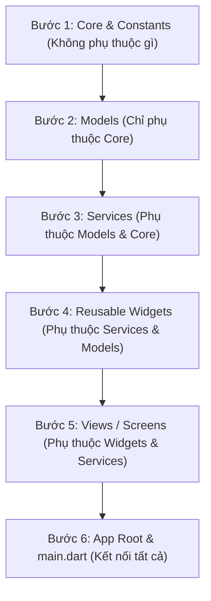

# 08 - Refactoring & Extension Guide for AI Agents

Tài liệu này là cẩm nang hướng dẫn dành cho AI Agent khi được yêu cầu **tái cấu trúc (refactor)**, chia tách tệp `lib/app.dart` hoặc **mở rộng tính năng mới** cho dự án **app_mushroom**.

---

## 1. Nợ kỹ thuật hiện tại (Technical Debt Analysis)

Tệp [`lib/app.dart`](file:///d:/500gb%20hdd%27s%20data/VSCodeProject/flutter/test/app_mushroom/lib/app.dart) hiện chứa **3.776 dòng code** với toàn bộ:
- Khởi tạo ứng dụng & Theme
- 5 Màn hình (Views) và 2 Dialog
- 4 Dịch vụ (Services)
- 7 Mô hình dữ liệu (Models)
- Thuật toán thị giác máy tính chấm điểm chất lượng ảnh
- Hệ thống đa ngôn ngữ tự chế

> [!WARNING]
> Việc chỉnh sửa trực tiếp trên một tệp 3.776 dòng dễ dẫn đến việc vượt quá giới hạn token của AI Agent hoặc xung đột context. Cần thực hiện tái cấu trúc theo kiến trúc thư mục chuẩn Flutter dưới đây.

---

## 2. Kiến trúc thư mục chuẩn đề xuất (Target Modular Architecture)

```
lib/
├── main.dart                                    # Điểm khởi chạy app
├── app.dart                                     # Root MushroomRecognizerApp & theme
└── src/
    ├── core/
    │   ├── constants/
    │   │   └── app_constants.dart              # kDefaultBackendBaseUrl, key prefs
    │   ├── localization/
    │   │   ├── app_language.dart               # Enum AppLanguage & AppLanguageX
    │   │   └── app_text_scope.dart             # AppTextScope & hàm tr()
    │   └── theme/
    │       └── app_theme.dart                  # Light/Dark Theme Material 3
    ├── models/
    │   ├── app_config.dart                     # AppConfig model
    │   ├── catalog_item.dart                   # MushroomCatalogResponse & Item
    │   ├── history_item.dart                   # RecognitionHistoryItem
    │   ├── job_status.dart                     # Enum JobStatus & extension
    │   ├── prepared_frame.dart                 # PreparedFrame model
    │   ├── queue_event.dart                    # QueueEvent model
    │   └── queue_job.dart                      # QueueJob model
    ├── services/
    │   ├── app_preferences_service.dart        # SharedPreferences wrapper
    │   ├── backend_queue_service.dart          # HTTP & WebSocket queue engine
    │   ├── frame_selector_service.dart         # Video frame extraction & scoring
    │   └── recognition_history_service.dart    # Local media & JSON persistence
    ├── views/
    │   ├── catalog/
    │   │   └── mushroom_catalog_page.dart      # Màn hình danh mục nấm
    │   ├── history/
    │   │   └── recognition_history_page.dart   # Màn hình lịch sử
    │   ├── home/
    │   │   └── main_menu_page.dart             # Màn hình menu chính
    │   ├── intro/
    │   │   └── intro_page.dart                 # Màn hình giới thiệu
    │   ├── recognition/
    │   │   └── mushroom_recognition_page.dart  # Màn hình nhận diện nấm
    │   └── settings/
    │       └── settings_page.dart              # Màn hình cài đặt
    └── widgets/
        ├── common/
        │   ├── menu_action_card.dart           # Thẻ chức năng menu
        │   └── stat_chip.dart                  # Chip hiển thị số liệu thống kê
        ├── dialogs/
        │   ├── first_run_backend_dialog.dart   # Dialog cấu hình lần đầu
        │   └── result_popup_dialog.dart        # Dialog popup kết quả job
        └── results/
            ├── job_result_card.dart            # Card hiển thị job trong queue
            ├── result_payload_view.dart        # Khung hiển thị chi tiết kết quả AI
            └── result_row.dart                 # Dòng hiển thị nhãn - giá trị
```

---

## 3. Lộ trình phân rã an toàn từng bước (Step-by-Step Refactoring Protocol)

Để không làm gián đoạn mã nguồn hoặc gây lỗi biên dịch, Agent cần thực hiện tuần tự theo thứ tự phụ thuộc từ dưới lên (Bottom-Up):



### Chi tiết các bước:
1. **Bước 1 (Core):** Trích xuất `AppLanguage`, `AppTextScope`, `tr(...)`, các hằng số `kDefaultBackendBaseUrl`, `_kPref...`.
2. **Bước 2 (Models):** Trích xuất `JobStatus`, `QueueJob`, `PreparedFrame`, `QueueEvent`, `RecognitionHistoryItem`, `MushroomCatalogResponse`, `MushroomCatalogItem`, `AppConfig`.
3. **Bước 3 (Services):** Trích xuất `FrameSelectorService`, `AppPreferencesService`, `RecognitionHistoryService`, và `BackendQueueService`.
4. **Bước 4 (Widgets):** Trích xuất `_ResultPayloadView`, `_ResultRow`, `_JobResultCard`, `_StatChip`, `_MenuActionCard`, `_FirstRunBackendDialog`.
5. **Bước 5 (Views):** Trích xuất các trang: `MainMenuPage`, `IntroPage`, `SettingsPage`, `MushroomCatalogPage`, `RecognitionHistoryPage`, `MushroomRecognitionPage`.
6. **Bước 6 (App Root):** Giữ lại `MushroomRecognizerApp` trong `lib/app.dart` (hoặc `lib/src/app.dart`) với kích thước tinh gọn dưới 150 dòng.

---

## 4. Hướng dẫn viết kiểm thử tự động (Testing Guide)

Khi Agent thực hiện tái cấu trúc, bắt buộc phải tạo các bài kiểm thử tương ứng trong thư mục `test/`:

### 4.1. Unit Test cho thuật toán trích xuất frame (`test/frame_selector_test.dart`)
- **Kiểm thử `_buildSamplePoints`:** Đảm bảo với video có độ dài bất kỳ (ví dụ 10 giây), hàm sinh đúng 8 mốc thời gian tăng dần và không vượt quá tổng thời lượng.
- **Kiểm thử `_scoreFrameQuality`:**
  - Ảnh đen toàn phần ($\text{Lum} = 0$) -> điểm chất lượng xấp xỉ $0.0$.
  - Ảnh trắng toàn phần ($\text{Lum} = 255$) -> điểm chất lượng xấp xỉ $0.0$.
  - Ảnh có độ tương phản cao và phơi sáng tốt -> điểm chất lượng $> 0.6$.

### 4.2. Unit Test cho chuẩn hóa URL (`test/url_normalization_test.dart`)
- Kiểm tra `BackendQueueService.normalizeBaseUrl('http://192.168.1.10:8000/')` -> `'http://192.168.1.10:8000'`.
- Kiểm tra URL thiếu scheme hoặc scheme `ftp://` phải ném `FormatException`.

### 4.3. Unit Test cho Model Serialization (`test/models_test.dart`)
- Kiểm tra parse JSON từ Backend FastAPI vào `RecognitionHistoryItem` và `MushroomCatalogResponse`.
- Đảm bảo trường `accepted_prediction` parse linh hoạt cả `bool`, `int` ($1/0$), và `String` (`"true"`).

---

## 5. Tiềm năng mở rộng tính năng trong tương lai (Extension Backlog)

Nếu người dùng yêu cầu nâng cấp tính năng, Agent có thể tham khảo các hướng đi sau:

1. **Hiển thị Bounding Box / Segmentation Mask:**
   - Nếu backend trả về tọa độ hộp bao `[ymin, xmin, ymax, xmax]` trong `result['boxes']`, tạo một `CustomPainter` vẽ bounding box trực tiếp đè lên khung hình ảnh xem trước.
2. **Hỗ trợ chạy suy luận Offline (On-Device Inference):**
   - Tích hợp `tflite_flutter` hoặc `onnxruntime` để cho phép người dùng nhận diện nấm ngay cả khi vào rừng không có sóng điện thoại hoặc mất mạng backend.
3. **Mở rộng chia sẻ kết quả (Share Feature):**
   - Dùng package `share_plus` để người dùng có thể chia sẻ ảnh kết quả nhận diện nấm kèm khuyến cáo an toàn qua Zalo / Facebook / Tin nhắn.
4. **Xuất file báo cáo lịch sử (Export CSV / PDF):**
   - Cho phép xuất toàn bộ 200 bản ghi trong `RecognitionHistoryService` ra file CSV hoặc PDF phục vụ nghiên cứu sinh học.

