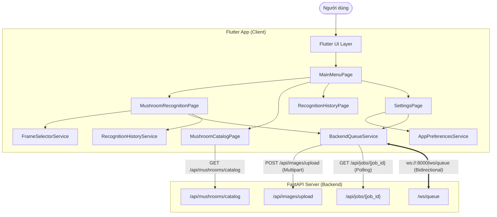

# Mushroom Recognizer - AI Agent Specification Index

Tài liệu này là **Cổng điều hướng ngữ cảnh (Context Router)** dành riêng cho AI Agent khi tiếp cận, phân tích, sửa lỗi hoặc phát triển tính năng cho ứng dụng **app_mushroom**.

---

## 1. Bản tóm tắt nhanh cho Agent (Executive Summary)

- **Tên dự án:** `app_mushroom`
- **Mục tiêu hệ thống:** Ứng dụng Flutter di động/đa nền tảng cho bài toán nhận diện nấm ăn được / nấm độc bằng cách chụp ảnh, tải ảnh từ thư viện, hoặc quay video và trích xuất khung hình tối ưu, sau đó đẩy công việc xử lý lên backend FastAPI thông qua hàng đợi (Queue) thời gian thực (WebSocket) kết hợp cơ chế thăm dò dự phòng (Fallback Polling).
- **Hiện trạng mã nguồn:** Logic ứng dụng hiện tại đang nằm tập trung chủ yếu trong file [`lib/app.dart`](file:///d:/500gb%20hdd%27s%20data/VSCodeProject/flutter/test/app_mushroom/lib/app.dart) (3.776 dòng) và khởi chạy từ [`lib/main.dart`](file:///d:/500gb%20hdd%27s%20data/VSCodeProject/flutter/test/app_mushroom/lib/main.dart).
- **Ngôn ngữ hỗ trợ:** Đa ngôn ngữ (Tiếng Việt `vi` và Tiếng Anh `en`), mặc định là `vi`.

---

## 2. Bản đồ tài liệu đặc tả (Documentation Sitemap)

Để tiết kiệm context window và tăng tốc độ suy luận, Agent chỉ nên đọc các tài liệu tương ứng với nhiệm vụ cụ thể theo bảng dưới đây:

| Tệp tài liệu | Nội dung trọng tâm | Khi nào Agent cần đọc? |
| :--- | :--- | :--- |
| [`01_architecture_overview.md`](./01_architecture_overview.md) | Kiến trúc tổng quan, công nghệ, vòng đời khởi tạo và Bootstrap | Khi bắt đầu dự án, tìm hiểu luồng khởi chạy, cấu hình AppTheme |
| [`02_backend_api_and_websocket.md`](./02_backend_api_and_websocket.md) | Giao thức HTTP REST API, kết nối WebSocket, cấu trúc Payload | Khi sửa đổi backend, sửa lỗi kết nối mạng, debug hàng đợi Job |
| [`03_ui_and_screens.md`](./03_ui_and_screens.md) | Đặc tả 5 màn hình chính, các Dialog, Widget cây phân cấp | Khi cần sửa giao diện, bổ sung màn hình mới, thay đổi UX |
| [`04_media_processing_and_frame_selection.md`](./04_media_processing_and_frame_selection.md) | Thuật toán trích xuất frame từ video, tính độ sắc nét & phơi sáng | Khi cải tiến thuật toán chọn ảnh, tối ưu tốc độ xử lý video |
| [`05_services_and_state_management.md`](./05_services_and_state_management.md) | Chi tiết các Service: Queue, History, Preferences, Localization | Khi cần can thiệp logic nghiệp vụ, quản lý luồng dữ liệu |
| [`06_data_models_and_storage.md`](./06_data_models_and_storage.md) | Chi tiết Data Models, JSON Schemas, SharedPreferences & Media File | Khi bổ sung trường dữ liệu mới, sửa đổi cấu trúc lưu trữ |
| [`07_edge_cases_and_error_handling.md`](./07_edge_cases_and_error_handling.md) | Ma trận lỗi mạng, timeout, mất kết nối, reconnect, dữ liệu rỗng | Khi debug lỗi crash, xử lý timeout 15s, trạng thái offline |
| [`08_refactoring_and_extension_guide.md`](./08_refactoring_and_extension_guide.md) | Hướng dẫn tách file `lib/app.dart` thành kiến trúc chuẩn module | Khi tiến hành dọn dẹp mã nguồn, chia nhỏ thư mục `lib/src/` |

---

## 3. Sơ đồ tương quan hệ thống (System Architecture Diagram)

---

## 4. Hướng dẫn nhanh cho Agent thực thi lệnh (Agent Action Cheatsheet)

### 4.1. Lấy thông tin cấu hình hiện tại
- File cấu hình gói: [`pubspec.yaml`](file:///d:/500gb%20hdd%27s%20data/VSCodeProject/flutter/test/app_mushroom/pubspec.yaml)
- File mã nguồn chính: [`lib/app.dart`](file:///d:/500gb%20hdd%27s%20data/VSCodeProject/flutter/test/app_mushroom/lib/app.dart)
- Các package trọng yếu: `http`, `web_socket_channel`, `video_player`, `video_thumbnail`, `image`, `shared_preferences`.

### 4.2. Nguyên tắc bất biến khi sửa đổi mã nguồn
1. **Bảo tồn tính tương thích với Backend FastAPI:** Các trường dữ liệu trong Job Payload (`prediction`, `raw_prediction`, `accepted_prediction`, `confidence`, `is_poisonous`, `decision_reason`) không được phép đổi tên vì phụ thuộc vào server.
2. **Cơ chế Dual-Sync:** Quá trình theo dõi Job vừa lắng nghe sự kiện WebSocket vừa có timer Polling (`2 giây/lần`). Không được xóa timer polling vì phòng trường hợp WebSocket bị rớt gói tin hoặc ngắt kết nối.
3. **Đa ngôn ngữ:** Mọi chuỗi hiển thị trên UI bắt buộc sử dụng helper `tr(context, vi: '...', en: '...')` hoặc hàm `_tr(vi, en)` tương ứng.

