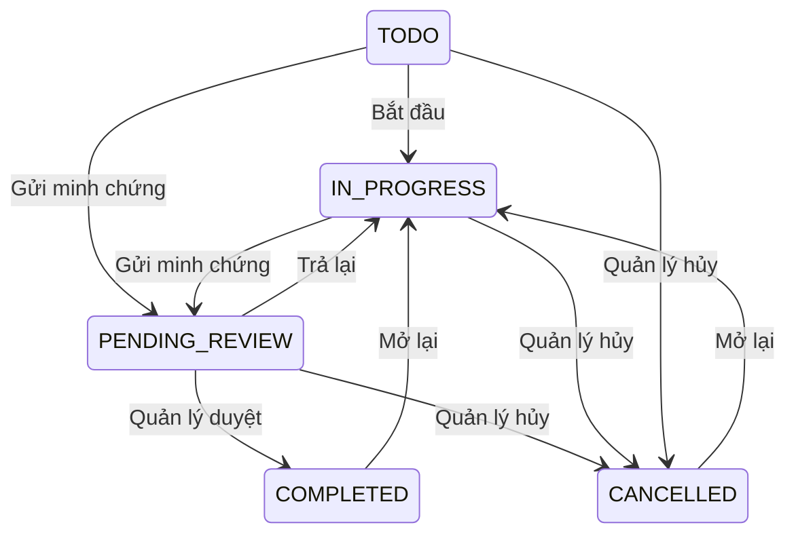

# S17 — Công việc, minh chứng và duyệt

**Vị trí:** Quản lý → Công việc; chi tiết là màn đẩy theo UUID. **Quyền xem:** mọi role nội bộ. [API chung](API_CONTRACT.md).

## 1. Danh sách và giao việc

List 10/trang: tiêu đề, lô, người nhận, hạn, trạng thái và mở chi tiết. Search title, filter status/batchId/assigneeUserId; “Việc của tôi” đặt assigneeUserId bằng user hiện tại. Backend không mặc định giới hạn staff chỉ nhìn việc của mình.

Không gửi status → TODO + IN_PROGRESS + PENDING_REVIEW. `status=ALL` lấy mọi trạng thái; status cụ thể lọc riêng. Thứ tự dueAt tăng dần (null cuối), createdAt giảm dần, ID tăng dần. Nhãn: TODO “Cần làm”, IN_PROGRESS “Đang thực hiện”, PENDING_REVIEW “Chờ duyệt”, COMPLETED “Hoàn thành”, CANCELLED “Đã hủy”.

Manager/admin tạo, sửa, giao việc. Form title bắt buộc 1–255 ký tự; description tùy chọn; batchId/assigneeUserId nullable; dueAt nullable ISO UTC. Picker người nhận gọi **task-assignees**, không admin/users. Tạo không có lựa chọn status COMPLETED.

## 2. API công việc

| Method / path | Query / body | Response |
| --- | --- | --- |
| GET /api/dashboard/tasks | page, limit, search, status, batchId, assigneeUserId | 200 data/pagination |
| GET /api/dashboard/tasks/{id} | UUID | 200 data TaskDetail |
| POST /api/dashboard/tasks | TaskCreateInput, manager/admin | 201 message/data Task |
| PATCH /api/dashboard/tasks/{id} | TaskUpdateInput theo quyền/trạng thái | 200 message/data Task |
| DELETE /api/dashboard/tasks/{id} | Manager/admin, chưa có lịch sử | 200 message; có lịch sử → 409 |
| GET /api/dashboard/task-assignees | page, limit, search; manager/admin | 200 data/pagination |
| GET /api/cultivation-batches | page, limit, search trong picker lô | 200 data/pagination |

List/assignees tối đa 50/trang. List/create/patch task có `submissions` tối đa một summary lần gửi gần nhất; **GET detail** trả toàn bộ submissions/evidence/notes. Task có `id,title,description,status,batchId,batchCode,assigneeUserId,assignee,dueAt,createdByUserId,createdAt,updatedAt,version,submissions`. Assignee là `{id,username,full_name,role:string}`. Không gửi version/actor/timestamps.

Tạo mẫu:

```json
{
  "title": "Cập nhật tiến trình sinh trưởng",
  "description": "Kiểm tra và chụp ảnh giai đoạn hiện tại",
  "batchId": 1,
  "assigneeUserId": 7,
  "dueAt": "2026-10-06T10:00:00.000Z"
}
```

Staff chỉ PATCH `{"status":"TODO"}` hoặc `{"status":"IN_PROGRESS"}` khi là người nhận và task đang TODO/IN_PROGRESS; không sửa nội dung/giao lại. Manager/admin có thể sửa nội dung/hạn/links hoặc chuyển TODO/IN_PROGRESS/CANCELLED tùy trạng thái. **Không PATCH COMPLETED hoặc PENDING_REVIEW**; chỉ submit/review đổi sang hai trạng thái đó.

PENDING_REVIEW: khóa đổi batchId/assigneeUserId, **bỏ hai field này khỏi request**, kể cả giá trị không đổi. Quản lý còn sửa title/description/dueAt hoặc hủy. Status không đổi cũng được bỏ khỏi PATCH; không gửi lại PENDING_REVIEW.

Có lịch sử thì ẩn Xóa, dùng CANCELLED. Hủy lúc chờ duyệt làm submission PENDING thành CANCELLED. COMPLETED/CANCELLED có “Mở lại công việc”, xác nhận rồi PATCH `{"status":"IN_PROGRESS"}`; giữ lịch sử. Sửa nội dung việc hoàn thành không đồng nghĩa tự mở lại.

## 3. Chọn và ghi minh chứng

Chỉ **người nhận task TODO/IN_PROGRESS** có Gửi minh chứng. Bottom sheet cao 92% có filter tất cả/chăm sóc/sinh trưởng/thu hoạch, list phân trang, bộ đếm đã chọn, ghi chú và form ghi hành động ngay.

| Method / path | Query / body | Response |
| --- | --- | --- |
| GET /api/dashboard/tasks/{id}/evidence-candidates | page=1, limit=10, type tùy chọn | 200 data/pagination; chỉ người nhận |
| POST /api/dashboard/tasks/{id}/submissions | evidence + notes | 201 message/data submission |

Type: `CARE_LOG,GROWTH_PROGRESS,HARVEST`. Candidate là `{type,recordId:integer,record:{...}}`; growth record kèm images. Server chỉ trả hành động người nhận đã **tạo hoặc cập nhật**; task gắn lô thì cùng batchId, task không gắn lô có thể lấy hành động thuộc nhiều lô. Không có điều kiện bắt buộc record phải được tạo sau task trong contract hiện tại.

Giữ lựa chọn bằng map khóa `type:recordId` qua page/filter; không trùng cùng cặp, tổng 1–20. Preview nội dung/thời điểm/lô và ảnh growth trước gửi. Ghi chú tùy chọn ≤10.000 ký tự.

Ba nút ghi ngay dùng đúng form [care S05](S05_CARE_LOGS.md), [growth S07](S07_GROWTH_PROGRESS.md), [harvest S06](S06_HARVESTS.md). Task chưa có batchId yêu cầu chọn lô cho hành động. Việc ghi không tự gắn lại batchId của task. Sau tạo dùng **record trong response server**, thêm selection theo đúng type/ID và tải lại candidates; không suy đoán ID từ thứ tự list.

Payload gửi:

```json
{
  "evidence": [
    {"type": "CARE_LOG", "recordId": 12},
    {"type": "GROWTH_PROGRESS", "recordId": 34}
  ],
  "notes": "Đã kiểm tra độ ẩm và cập nhật ảnh"
}
```

Không gửi record/snapshot/image URL trong body. Server kiểm tra ownership/lô/tính tồn tại/trùng, chụp snapshot và đổi task sang PENDING_REVIEW trong transaction. Thành công reload task và khóa gửi tiếp; list/dashboard lấy trạng thái mới khi mở lại hoặc làm mới.

## 4. Lịch sử và duyệt

Detail hiển thị toàn bộ lần gửi theo thời gian giảm dần: submittedAt, người gửi, notes, status, reviewedAt/người duyệt/reason và từng `evidence[].record` **snapshot lúc gửi**. Không fetch nhật ký hiện tại để thay snapshot.

Submission ID/taskId UUID; submittedByUserId/reviewedByUserId integer nullable. Status submission là `PENDING,APPROVED,REJECTED,CANCELLED`, khác status task.

| Method / path | Body / quyền | Response |
| --- | --- | --- |
| POST /api/dashboard/tasks/{id}/submissions/{submissionId}/review | Manager/admin khác người gửi; decision + reason | 200 message/data submission |

Duyệt có dialog xác nhận:

```json
{"decision": "APPROVE"}
```

Trả lại bắt buộc reason trim không rỗng, ≤10.000 ký tự:

```json
{"decision": "REJECT", "reason": "Bổ sung ảnh giai đoạn sinh trưởng và nội dung kiểm tra"}
```

Chỉ hiện nút khi task PENDING_REVIEW, submission PENDING và reviewer khác submittedByUserId. APPROVE → submission APPROVED/task COMPLETED; REJECT → REJECTED/task IN_PROGRESS. Người nhận bổ sung hành động/gửi lần mới; lần cũ và snapshot không đổi. Backend không cho tự duyệt kể cả admin.



## 5. Lỗi và nghiệm thu

409 từ submit/review/patch/delete/reopen: tải lại task, báo trạng thái đã thay đổi, không gửi lại mutation tự động; đóng form trạng thái đã lỗi thời khi cần. Lỗi validation/network thông thường giữ input/selection. Chống nhấn đôi và khóa nút đang gửi.

- [ ] Gửi → chờ duyệt → duyệt mới hoàn thành; trả lại → bổ sung → gửi mới.
- [ ] Snapshot không đổi sau sửa record; history đủ cả lần trả lại/hủy.
- [ ] Selection qua nhiều trang/filter, chống trùng, min 1/max 20, notes giới hạn.
- [ ] Task không gắn lô ghi được sau chọn lô; record server tự chọn chính xác.
- [ ] Staff sai owner, tự duyệt, đổi links khi pending, PATCH completed đều bị chặn.
- [ ] 409 tải lại, không double-submit; task có history không xóa, mở lại giữ history.
